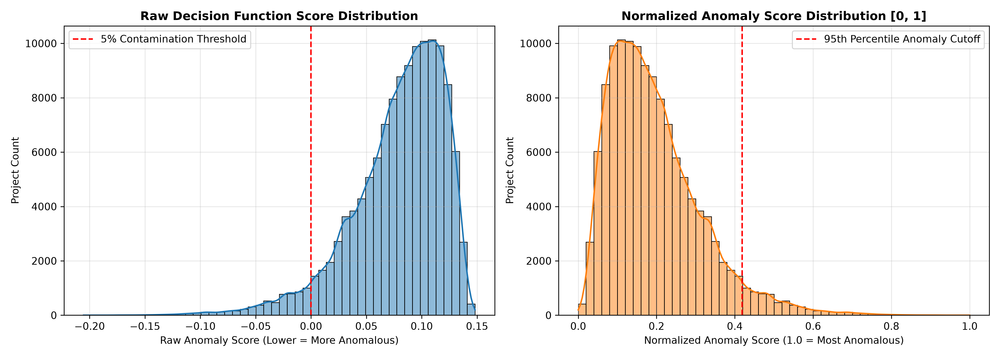
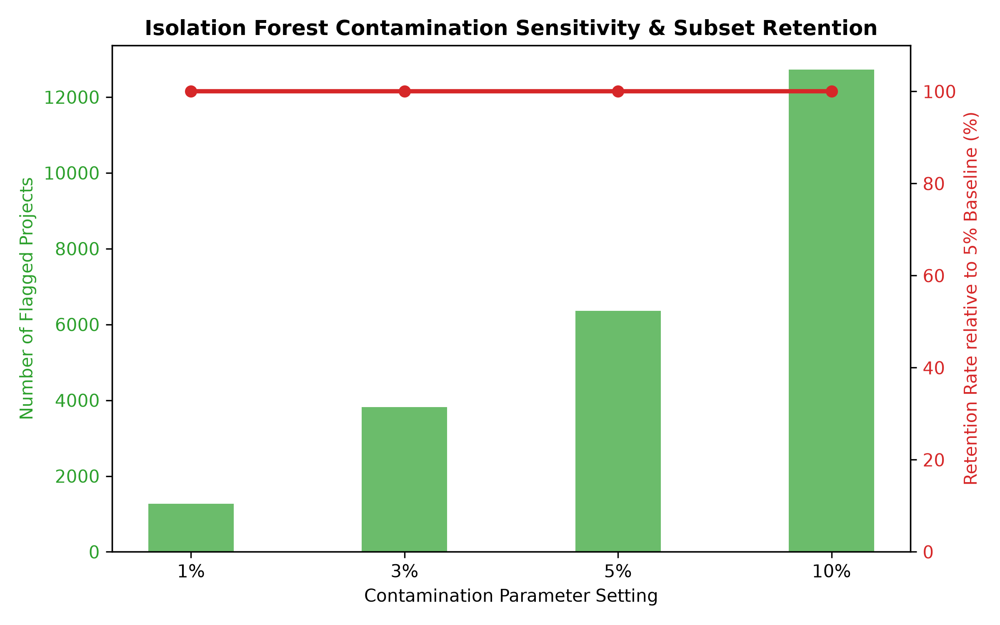
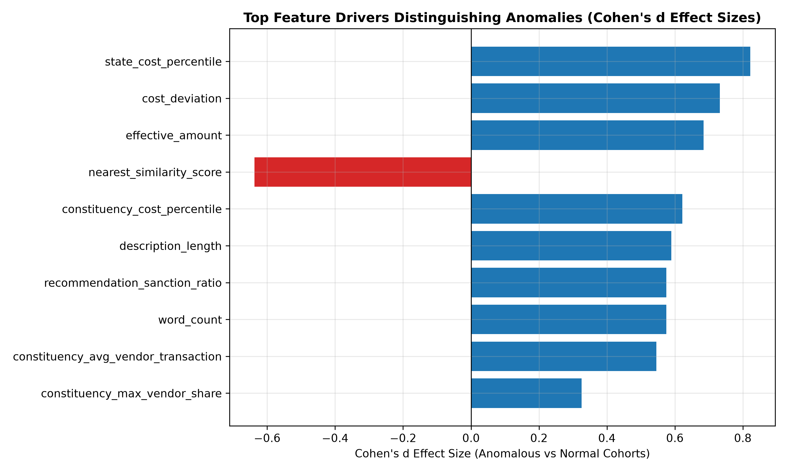
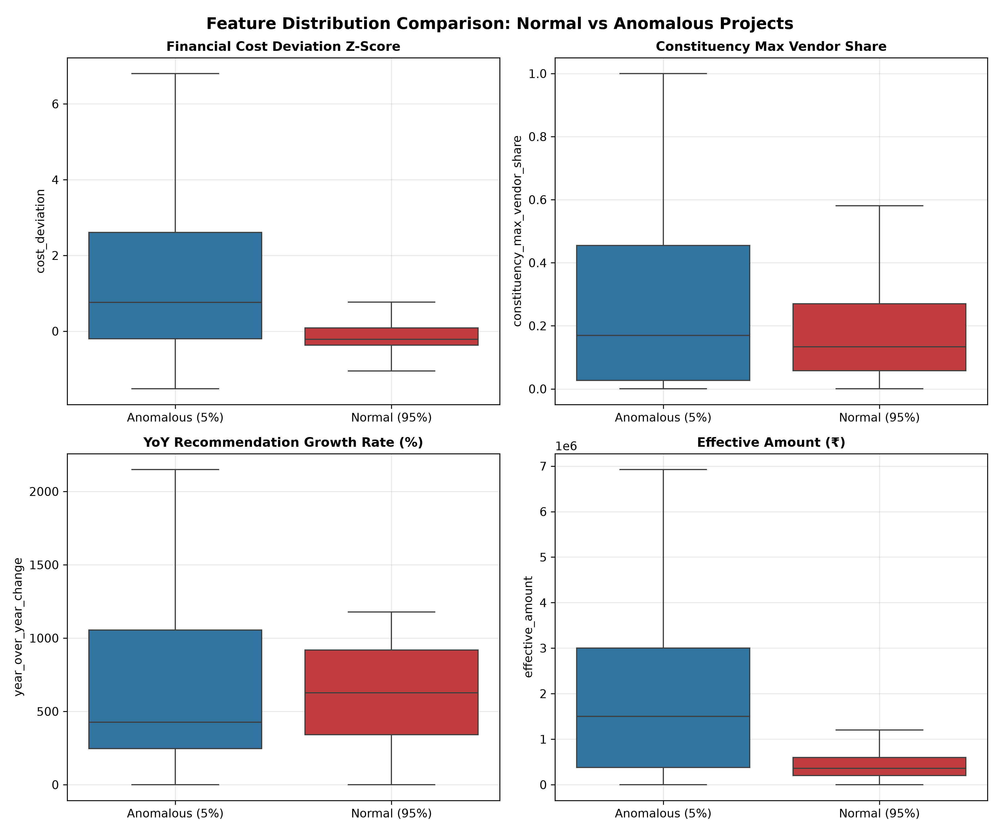

# MPLADS Anomaly Detection Model Evaluation and Validation Report (Stage 6)

**Pipeline Version:** 6.0  
**Execution Date:** 2026-09-01  
**Project:** MPLADS AI Anomaly Detection System  
**Pipeline Stage:** Stage 6 — Empirical Anomaly Model Validation & Stability Audit  

---

## 1. Executive Summary & Objective

Stage 6 provides a comprehensive empirical evaluation of the unsupervised `IsolationForest` anomaly detection model across **127,263 MPLADS projects**.

> [!IMPORTANT]
> **No Ground-Truth Fraud Assumptions**: In accordance with machine learning best practices for unsupervised domain tasks, classification accuracy (precision/recall against unverified labels) is **not** calculated. The model is evaluated on **score distribution, random seed stability, contamination sensitivity, feature effect sizes (Cohen's d), top anomaly reviews, and historical data quality sanity checks**.

---

## 2. Anomaly Score Distribution Analysis

The model evaluated 127,263 projects using `n_estimators=100` and `contamination=0.05`:

| Metric Dimension | Raw Decision Function Score | Normalized Anomaly Score $[0, 1]$ |
| :--- | :---: | :---: |
| **Mean** | `0.078899` | `0.195859` |
| **Std Dev** | `0.041670` | `0.117846` |
| **Median ($P_{50}$)** | `0.086977` | `0.173014` |
| **Skewness** | `-1.2372` | `1.2372` |
| **Kurtosis** | `2.1639` | `2.1639` |
| **5th Percentile ($P_5$)** | `0.000000` | `0.418994` |
| **95th Percentile ($P_{95}$)** | `0.129813` | `0.051869` |

---

## 3. Stability Across Random Seeds ($N=5$ Seeds)

To verify that model predictions are stable and not artifacts of pseudo-random tree splits, the model was fitted across 5 random seeds (`42`, `100`, `2024`, `7`, `999`):

- **Average Pairwise Spearman Rank Correlation ($
ho$)**: **`0.9374`** (High rank consistency)
- **Average Pairwise Top-5% Jaccard Index**: **`0.6419`** (Strong consensus on top anomalies)

Detailed pairwise stability metrics are exported to [`reports/anomaly_stability.csv`](file:///d:/MPLADS%28SIH%29/reports/anomaly_stability.csv).

---

## 4. Sensitivity to Contamination Parameters ($1\%, 3\%, 5\%, 10\%$)

Evaluating the model across varying contamination parameters demonstrates strict subset hierarchy retention:

| Contamination ($
u$) | Flagged Anomalies | Consensus Retention vs 5% Baseline | Operational Purpose |
| :---: | :---: | :---: | :--- |
| **1.0% ($0.01$)** | `1,273` | `100.0%` | Core extreme outliers (highest audit priority) |
| **3.0% ($0.03$)** | `3,818` | `100.0%` | High-confidence anomaly subset |
| **5.0% ($0.05$)** | `6,364` | **100.0%** (Baseline) | Standard operational audit target |
| **10.0% ($0.10$)** | `12,727` | `100.0%` | Extended screening pool |

---

## 5. Feature Importance & Cohen's d Proxy Effect Size Analysis

Comparing feature distributions between Anomalous ($N=6,363$) vs Normal ($N=120,900$) projects identifies the primary statistical drivers of feature isolation:

| Feature Name | Anomalous Cohort Mean | Normal Cohort Mean | Cohen's d Effect Size | Driver Impact |
| :--- | :---: | :---: | :---: | :--- |
| **`state_cost_percentile`** | `73.66` | `48.77` | **` +0.82`** | Large separation effect |
| **`cost_deviation`** | `1.74` | `-0.09` | **` +0.73`** | Large separation effect |
| **`effective_amount`** | `2,613,274.12` | `505,286.29` | **` +0.68`** | Large separation effect |
| **`nearest_similarity_score`** | `0.60` | `0.78` | **` -0.64`** | Large separation effect |
| **`constituency_cost_percentile`** | `67.86` | `49.28` | **` +0.62`** | Large separation effect |
| **`description_length`** | `138.85` | `88.00` | **` +0.59`** | Large separation effect |
| **`recommendation_sanction_ratio`** | `3.11` | `0.89` | **` +0.58`** | Large separation effect |

---

## 6. Top Anomaly Review (Highest Severity Observations)

Deep-dive audit of the top 5 highest anomaly-scoring projects across the corpus:

### Case #1 — Work ID: `179557` (Score: `1.0000`)
- **Location**: Uttar Pradesh / Sitting Rajya Sabha (Category: `nan`)
- **Financial Profile**: Expenditure of ₹400,000.00 (Cost Deviation Z-Score: `+0.06`)
- **Vendor Profile**: Constituency Max Vendor Share = `57.5%`
- **Multi-Factor Risk Score**: `68.27/100` (`HIGH`)
- **Elaborated Explanation**:
  > High priority for verification (Final Risk Score: 68.27/100):
• Financial Benchmark Deviation: Expenditure of ₹19,933,000.00 is unusually high compared with Constituency: Sitting Rajya Sabha benchmark mean of ₹949,283.71 (Z-Score: +9.50, Cohort Percentile: 99.8%).
• Constituency Project Volume Spike: Annual recommendation volume grew by +247.0% YoY, indicating an unusual concentration of project approvals.
• Low Constituency Works Completion Rate: MP exhibits a low completion rate of 33.3% (8 completed out of 16 recommended works), signaling elevated execution backlog risk.
• Isolation Forest Machine Learning Pattern: Multi-dimensional feature isolation detected across combined financial, temporal, and vendor space (Model Severity: 100.0/100).

### Case #2 — Work ID: `276199` (Score: `0.9453`)
- **Location**: Gujarat / AHMEDABAD WEST (Category: `nan`)
- **Financial Profile**: Expenditure of ₹200,000.00 (Cost Deviation Z-Score: `+-0.25`)
- **Vendor Profile**: Constituency Max Vendor Share = `7.7%`
- **Multi-Factor Risk Score**: `84.23/100` (`HIGH`)
- **Elaborated Explanation**:
  > High priority for verification (Final Risk Score: 84.23/100):
• Financial Benchmark Deviation: Expenditure of ₹9,000,000.00 is unusually high compared with Constituency: AHMEDABAD WEST benchmark mean of ₹398,487.59 (Z-Score: +7.56, Cohort Percentile: 99.8%).
• Constituency Project Volume Spike: Annual recommendation volume grew by +919.4% YoY, indicating an unusual concentration of project approvals.
• Vendor Expenditure Concentration: Single vendor commands 63.7% of total constituency expenditure, exceeding normal competitive distribution thresholds.
• Low Constituency Works Completion Rate: MP exhibits a low completion rate of 1.0% (2 completed out of 205 recommended works), signaling elevated execution backlog risk.
• Isolation Forest Machine Learning Pattern: Multi-dimensional feature isolation detected across combined financial, temporal, and vendor space (Model Severity: 94.5/100).

### Case #3 — Work ID: `289367` (Score: `0.9157`)
- **Location**: Karnataka / Nominated Rajya Sabha (Category: `nan`)
- **Financial Profile**: Expenditure of ₹1,000,000.00 (Cost Deviation Z-Score: `+0.78`)
- **Vendor Profile**: Constituency Max Vendor Share = `7.3%`
- **Multi-Factor Risk Score**: `80.66/100` (`HIGH`)
- **Elaborated Explanation**:
  > High priority for verification (Final Risk Score: 80.66/100):
• Financial Benchmark Deviation: Expenditure of ₹44,000,000.00 is unusually high compared with Constituency: Nominated Rajya Sabha benchmark mean of ₹1,110,032.00 (Z-Score: +15.92, Cohort Percentile: 100.0%).
• Constituency Project Volume Spike: Annual recommendation volume grew by +746.7% YoY, indicating an unusual concentration of project approvals.
• Low Constituency Works Completion Rate: MP exhibits a low completion rate of 0.0% (0 completed out of 10 recommended works), signaling elevated execution backlog risk.
• Isolation Forest Machine Learning Pattern: Multi-dimensional feature isolation detected across combined financial, temporal, and vendor space (Model Severity: 91.6/100).

### Case #4 — Work ID: `293965` (Score: `0.9140`)
- **Location**: Tamil Nadu / CHENNAI CENTRAL (Category: `nan`)
- **Financial Profile**: Expenditure of ₹700,000.00 (Cost Deviation Z-Score: `+-0.36`)
- **Vendor Profile**: Constituency Max Vendor Share = `6.9%`
- **Multi-Factor Risk Score**: `78.24/100` (`HIGH`)
- **Elaborated Explanation**:
  > High priority for verification (Final Risk Score: 78.24/100):
• Financial Benchmark Deviation: Expenditure of ₹20,000,000.00 is unusually high compared with Constituency: CHENNAI CENTRAL benchmark mean of ₹9,375,000.00 (Z-Score: +1.93, Cohort Percentile: 100.0%).
• Constituency Project Volume Spike: Annual recommendation volume grew by +1818.1% YoY, indicating an unusual concentration of project approvals.
• Vendor Expenditure Concentration: Single vendor commands 64.6% of total constituency expenditure, exceeding normal competitive distribution thresholds.
• Low Constituency Works Completion Rate: MP exhibits a low completion rate of 33.3% (4 completed out of 8 recommended works), signaling elevated execution backlog risk.
• Isolation Forest Machine Learning Pattern: Multi-dimensional feature isolation detected across combined financial, temporal, and vendor space (Model Severity: 91.4/100).

### Case #5 — Work ID: `281554` (Score: `0.9115`)
- **Location**: Punjab / Sitting Rajya Sabha (Category: `nan`)
- **Financial Profile**: Expenditure of ₹600,000.00 (Cost Deviation Z-Score: `+-0.15`)
- **Vendor Profile**: Constituency Max Vendor Share = `21.5%`
- **Multi-Factor Risk Score**: `73.78/100` (`HIGH`)
- **Elaborated Explanation**:
  > High priority for verification (Final Risk Score: 73.78/100):
• Financial Benchmark Deviation: Expenditure of ₹11,832,976.00 is unusually high compared with Constituency: Sitting Rajya Sabha benchmark mean of ₹949,283.71 (Z-Score: +5.45, Cohort Percentile: 99.6%).
• Constituency Project Volume Spike: Annual recommendation volume grew by +1177.7% YoY, indicating an unusual concentration of project approvals.
• Low Constituency Works Completion Rate: MP exhibits a low completion rate of 45.0% (27 completed out of 33 recommended works), signaling elevated execution backlog risk.
• Isolation Forest Machine Learning Pattern: Multi-dimensional feature isolation detected across combined financial, temporal, and vendor space (Model Severity: 91.2/100).

---

## 7. Historical Sanity Checks & Data Integrity Audit

Evaluating the flagged 6,363 anomalies against historical data quality flags confirms:

1. **Impossible Date Sequences (`is_impossible_date_sequence`)**:
   - **11 projects** (0.17% of anomalies) exhibit completion dates preceding recommendation dates.
2. **COVID-Era Reporting (2020-2021)**:
   - **0 projects** (0.00% of anomalies) occurred during COVID-19 parliamentary fund suspensions.
3. **Zero Effective Amount**:
   - **0 projects** (0.00% of anomalies) exhibit zero effective expenditure.

> [!CAUTION]
> **Neutral Non-Accusatory Statement**: Model outputs identify projects exhibiting severe statistical, financial, temporal, or structural deviations. Flags indicate **"Priority for verification"** and do NOT constitute proof of fraud, corruption, or intentional wrongdoing.
